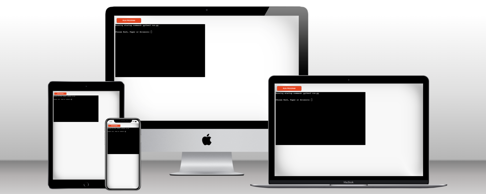
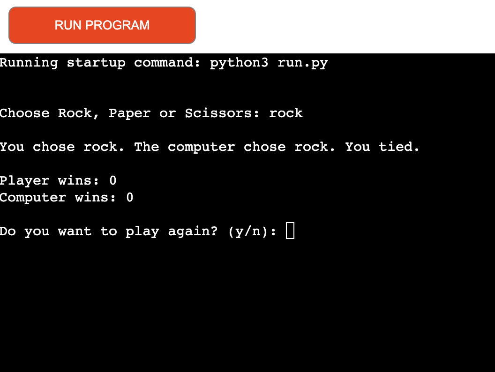
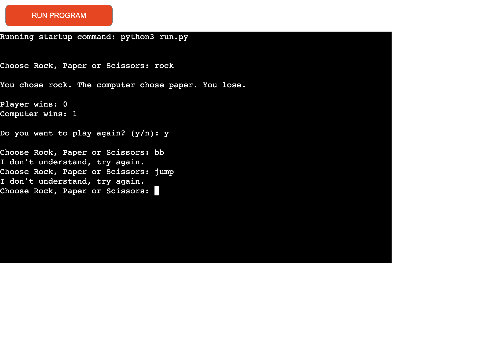
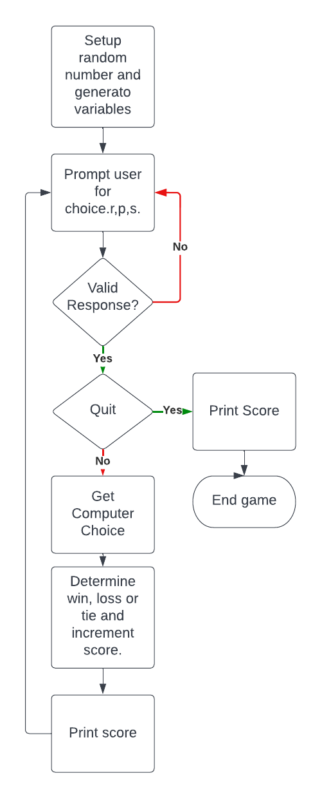
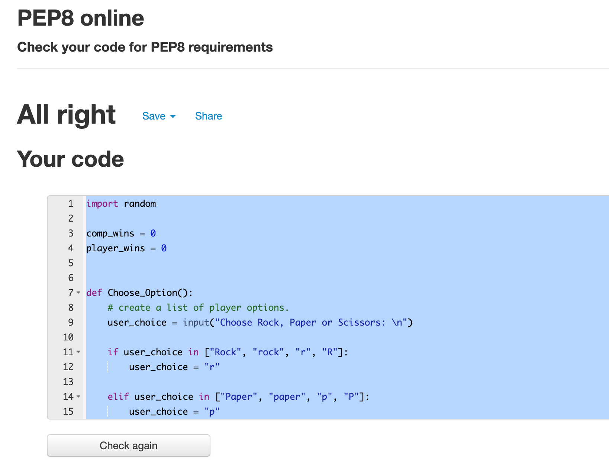

# ROCK PAPER SCISSORS

Rock,paper, scissors is a python terminal based game which runs in the Code Institute mock terminal on Heroku.
It is based on the traditional rock paper scissors hand game.
You can read more about it on [Wikipedia](https://en.wikipedia.org/wiki/Rock_paper_scissors)
[Wikipedia]:https://en.wikipedia.org/wiki/Rock_paper_scissors.
The live website through Heroku can be found here [RockPaperScissors Portfolio](https://gbemi-rock-paper-scissors.herokuapp.com/).
The live website through Github can be found here [RockPaperScissors](https://gbemisola23.github.io/rock-paper-scissors/).

## How To Play
 - There are three possible plays.
 - A player who decides to play rock will beat another player who has 
 chosen scissors ("rock crushes scissors" or "breaks scissors" or sometimes "blunts scissors"), 
 - but will lose to one who has played paper ("paper covers rock"); 
 a play of paper will lose to a play of scissors ("scissors cuts paper"). 
 - If both players choose the same shape, the game is tied and is usually immediately replayed to break the tie. 

## Objective
- The goal is to create an interactive user site experience using a command line interface.

## Features 
- Random number generators
- the user decides which play options they want.
- Play against the computer, accepts user input and maintains scores.
- If the player and computer both pick the same play options then it's a tie.

** Input Validation **
- If the user enters the wrong value, they get prompted to input the right value.

## Flow Chart
Using the website **LucidChart** the flow chart below simply described the flow process of the game.

## Validator Testing
I have manually tested this project by doing the following;
- passed the code through the pep8 linter and ensured every errors were corrected.
- tested in my local terminal and the Code Institute heroku terminal.
- Blank line contains whitespaces errors were given and resolved.

## Bugs
**Solved bugs**
- There were too many blank lines making some of the code ineffective and have been resolved.

## Languages.
- Python

##
No unresolved bugs

## Deployment
-  Navigate to Heroku website and either sign in or click sign up to create a new account.
- In your account dashboard click the Create new APP button.
- Add a name for APP in the APP-Name field.
- Select your region from the drop-down menu and click on Create APP button.
- On the next page click on the Settings tab to adjust the settings.
- Click on the "config vars" button and hide any sensitive files from being deployed.
- In the field for key add the sensitive file name and in the value field copy the entire file from your workspace into this field and click add.
- in the supply key field below this add PORT and 8000 into the value field. Then click on the "add" button.
- Click on the ADD Buildpack button.
- Select python buildpack and click save changes. Then click Add Buldpack button again but this time add node.js and save changes. Please ensure that you are adding them in this order as it may cause issues otherwise.
- Navigate to the deploy section by using the deploy tab a the top of the screen, select Github and connect to your Github profile.
- Search for your Github repo name by adding the name to the repo-name tab and click the search button.
- When the search is complete, click on the connect button to the right of your repo name.
- Now you can deploy the app automatically or manually. Automatically deploy will update the app automatically every time you push any changes to Github.
- Once the build is successful, you can open the app by clicking Open App button in the top right corner.

## Credits
- Code Institue for the deployment terminal
- Wikepedia for the details of the rockpaperscissors game
- LauraMayock Read.me was helpful in creating mine.
- Microxoft Course, youTube on how to create flowchart.
- Programiz, CS DOjo, 10minute train (YouTube) helped to understand how to create rock, paper, scissors, game.
- (https://thehelloworldprogram.com/python) helped to understand how to add comments.

