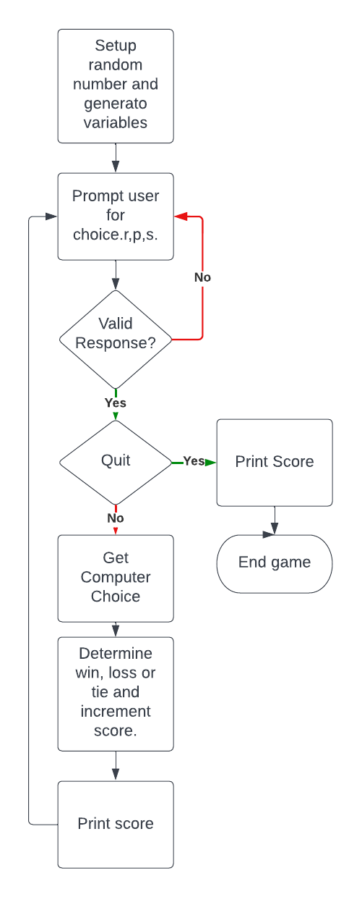

# ROCK PAPER SCISSORS

Rock,paper, scissors is a python terminal based game which runs in the Code Institute mock terminal on Heroku.
The live website can be found here [RockPaperScissors Portfolio](https://gbemi-rock-paper-scissors.herokuapp.com/).

## How To Play
 - It is based on the traditional rock paper scissors game. A player who decides to play rock will beat another player who has 
 chosen scissors ("rock crushes scissors" or "breaks scissors" or sometimes "blunts scissors"), 
 - but will lose to one who has played paper ("paper covers rock"); 
 a play of paper will lose to a play of scissors ("scissors cuts paper"). 
 - If both players choose the same shape, the game is tied and is usually immediately replayed to break the tie. 

## Objective
- The goal is to create an interactive user site experience using a command line interface.

## Flow Chart
Using the website **LucidChart** the flow chart below simply described the flow process of the game.

